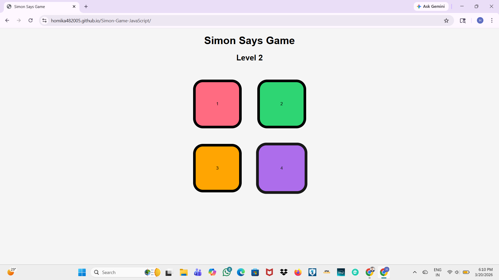

# 🎮 Simon Says Game

An interactive memory-based game built using HTML, CSS, and JavaScript where users repeat an increasingly complex sequence of colors.

---

## 🚀 Live Demo

👉 https://homika482005.github.io/Simon-Game-JavaScript/

---

## 📌 Features

* 🎯 Dynamic level progression
* 🎮 Interactive button animations
* ⚡ Real-time user input validation
* 🔄 Game reset on incorrect sequence
* 📱 Clean and responsive UI

---

## 🛠️ Tech Stack

* HTML5
* CSS3
* JavaScript (DOM Manipulation)

---

## 🧠 How It Works

* The game generates a random sequence of colors
* The user must repeat the sequence correctly
* With each level, the sequence becomes longer
* If the user makes a mistake, the game ends and resets

---

## 📸 Screenshot

---

## 💡 What I Learned

* DOM manipulation and event handling
* Building interactive UI with JavaScript
* Managing game state using arrays
* Writing cleaner and modular code

---

## 📂 Project Setup

1. Clone the repository
2. Open `index.html` in your browser

---

## 📌 Future Improvements

* Add sound effects 🔊
* Add difficulty levels
* Store high scores

---

## 🙋‍♀️ Author

**Homika Sirsate**
Aspiring Software Engineer | Full Stack Developer
